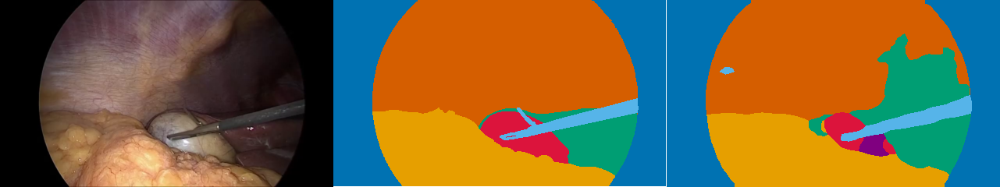
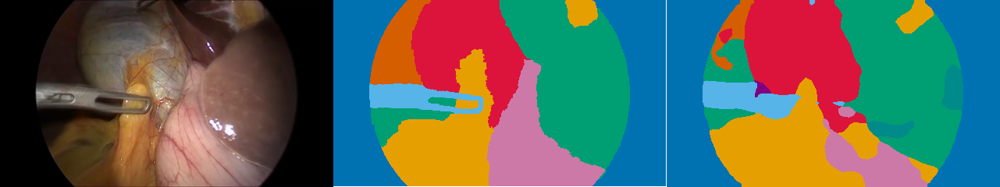
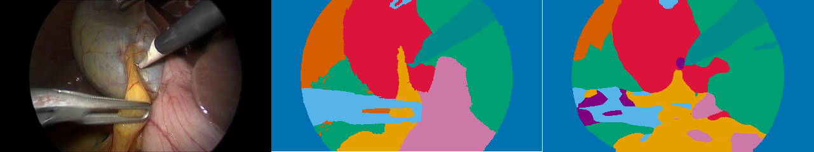

# CholecSeg8k Semantic Segmentation with DeepLabV3

This project studies 13-class semantic segmentation on CholecSeg8k using DeepLabV3-ResNet50. The goal is to build a clear baseline and to explain the dataset and evaluation choices behind the results.



Example prediction on a test video. From left to right: input image, ground-truth mask, and DeepLabV3 prediction.

## Dataset

CholecSeg8k is a semantic segmentation dataset built from annotated frames of laparoscopic cholecystectomy videos. The local copy used here contains 8080 annotated images from 17 videos.

Each sample includes an endoscopic RGB frame and several associated masks. In this project, I use the watershed mask as the training target, because it provides class-level labels that can be decoded into 13 semantic classes.

Download CholecSeg8k manually from [Hugging Face](https://huggingface.co/datasets/minwoosun/CholecSeg8k/blob/main/data/CholecSeg8k.zip) and place the unzipped dataset in the `dataset/` folder.

## How to Run

Create a Python environment and install the dependencies:

```bash
python3 -m venv .venv
.venv/bin/python -m pip install -r requirements.txt
```

Download CholecSeg8k manually from [Hugging Face](https://huggingface.co/datasets/minwoosun/CholecSeg8k/blob/main/data/CholecSeg8k.zip), unzip it, and place it so that this path exists:

```text
dataset/CholecSeg8k/
```

Create the output folder:

```bash
mkdir -p outputs
```

Check that the dataset can be loaded:

```bash
make test-dataset
```

Train the DeepLabV3 baseline. This writes logs and the best checkpoint to `outputs/`:

```bash
make train-baseline
```

If you do not want to retrain the model, download the checkpoint from the [DeepLabV3 baseline checkpoint release](https://github.com/mhjd/cholecseg8k-deeplabv3/releases/tag/deeplabv3-baseline-checkpoint) and place it at:

```text
outputs/best_deeplabv3_resnet50.pth
```

Evaluate the saved checkpoint on the test split:

```bash
make eval-finetuned
```

Generate prediction examples from the saved checkpoint:

```bash
make visualize_sample
```

## Mask Encoding Notes

For each image, the dataset provides a color mask for visualization and a class mask, called the watershed mask, intended for programmatic use.

One important detail is that the watershed masks do not store the foreground classes as contiguous IDs from 1 to 12. Instead, they use non-contiguous grayscale RGB codes such as `(11, 11, 11)`, `(21, 21, 21)`, and `(31, 31, 31)`. The class-to-code mapping is provided in the [CholecSeg8k Kaggle dataset description](https://www.kaggle.com/datasets/newslab/cholecseg8k), where each semantic class is associated with its watershed mask RGB code. These raw codes are mapped to contiguous class IDs `0-12` before training.

An issue is the presence of pixels with value `(255, 255, 255)` in almost all watershed masks. The dataset description does not clearly explain the semantic meaning of this value. Manual inspection suggests that `(255, 255, 255)` pixels in the watershed masks mainly come from the white border around the endoscopic field of view, and more occasionally from boundaries between annotated regions. Because the dataset documentation does not clearly define the meaning of this value, I treat it as an ignore label during training.

A second edge case is the rare presence of the raw code `(0, 0, 0)` in a small number of watershed masks. This value is not part of the documented class-to-code mapping. Given its extremely low frequency, I treat it as an ignore label rather than as a semantic class, while acknowledging that its exact meaning is not clearly documented.

## Dataset Split

CholecSeg8k is composed of annotated frames extracted from 17 surgical videos. Each video contains a different number of annotated images.

I used a video-level split instead of a random image-level split. Consecutive frames from the same video can be visually very similar, so putting nearby frames from the same video in both the training and validation/test sets could make the evaluation too optimistic.

The split used in this project is based on video IDs:

- train video IDs: 1, 9, 12, 17, 18, 20, 24, 25, 26, 27, 28, 35, 37
- validation video IDs: 43, 48
- test video IDs: 52, 55

This gives 6080 training images, 960 validation images, and 1040 test images. A limitation is that the number of annotated frames varies a lot between videos, from 160 frames for videos 18 and 20 to 1280 frames for video 1. In retrospect, it may have been better to assign shorter videos to validation and test, since longer videos are more useful for training. In this split, video 43 has 720 frames and video 52 has 800 frames, so two relatively long videos are not used for training.

## Experimental Setup

The model is a torchvision DeepLabV3-ResNet50 initialized without pretrained weights. I replaced the final classifier layer so that the model predicts the 13 CholecSeg8k classes.

Training uses cross-entropy loss with 255 as the ignore index. The original CholecSeg8k frames have a resolution of 854 x 480. I resized them to 427 x 240, which divides both dimensions by two and makes training more manageable on my machine. Masks are resized with nearest-neighbor interpolation to preserve class IDs.

All experiments were run locally on a MacBook Air M4 with 32 GB of RAM, using PyTorch MPS acceleration.

I trained the baseline for 3 epochs. This was mainly a practical choice, since one full run with training and validation already took about 2h10 on this setup. I also kept the batch size at 4, because larger batch sizes did not clearly reduce the total epoch time in my tests. They processed more images per step, but each step became slower by a similar factor.

The best checkpoint was selected using validation mIoU.

## Results

The table below reports the best validation checkpoint and its performance on the test split.

| Split | mIoU | Foreground IoU | Dice |
|---|---:|---:|---:|
| Validation | 0.611 | 0.542 | 0.679 |
| Test | 0.541 | 0.483 | 0.619 |

The validation and test scores are in the same range, with a moderate drop on the test videos. However, it is hard to make a reliable conclusion from this comparison, since the validation and test splits each contain only two videos.

## Qualitative Results

The following examples are taken from the test videos. Each panel shows, from left to right: the input image, the ground-truth mask, and the DeepLabV3 prediction.

These examples show how the model predictions compare visually with the ground-truth masks.






## Limitations and Next Steps

The main limitation of this baseline is the small experimental budget. Training was limited to 3 epochs, so the results should mainly be read as a first reference point.

The video-level split reduces the risk of evaluating on frames that are too similar to the training data. However, the number of annotated frames varies strongly between videos, which makes the split harder to balance. A more complete evaluation could compare several video-level splits.

The aggregate metrics give a useful overview, but they do not show which classes are well segmented and which ones are confused. A per-class analysis would be the most useful next step, especially together with visual examples of typical errors.
